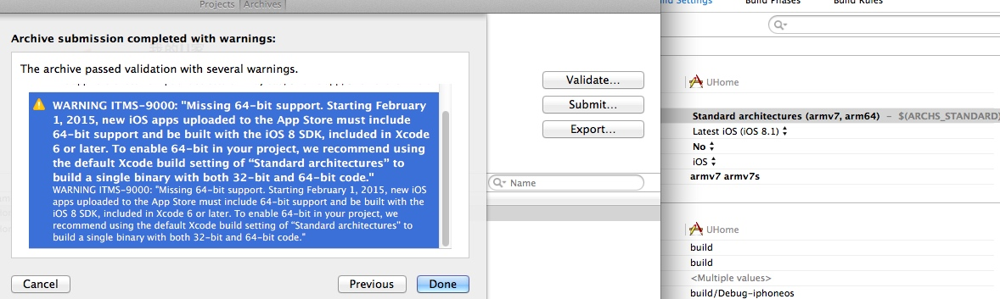
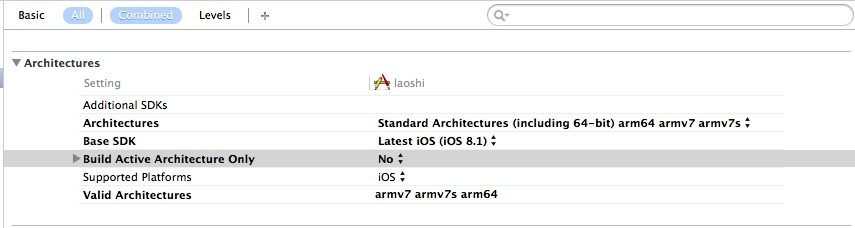
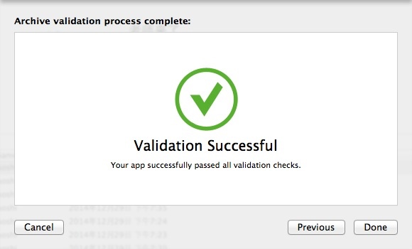
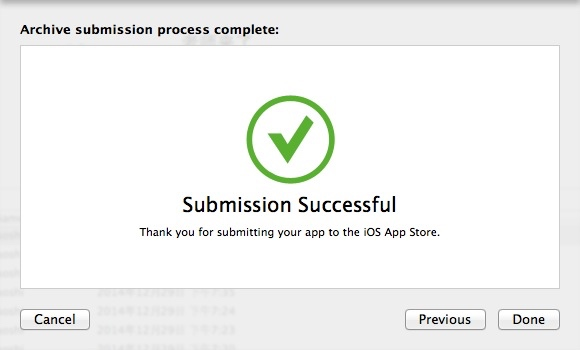

# armvXX是说cpu指令集，从IPhone4s以后就支持armv7了
，iphone4s支持armv6

iOS测试分为模拟器测试和真机测试，处理器分为32位处理器，和64位处理器，
模拟器32位处理器测试需要i386架构，（iphone5,iphone5s以下的模拟器）
模拟器64位处理器测试需要x86_64架构，(iphone6以上的模拟器)
真机32位处理器需要armv7,或者armv7s架构，（iphone4真机/armv7,      ipnone5,iphone5s真机/armv7s）
真机64位处理器需要arm64架构。(iphone6,iphone6p以上的真机)

http://blog.csdn.net/qq_26968709/article/details/50470929
支持64位
以源码形式出现在工程中的第三方lib，只要把target加上arm64编译就好了。

http://www.wahenzan.com/a/mdev/ios/2014/1231/1397.html

App store 发布，64位问题，Missing 64-bit support

经过好久的处理才找到解决办法

处理方法如下：

1、确保Xcode版本号>=5.0.1
2、更新project settings, minimum deployment target >= 5.1.1
3、Valid Architectures 添加设置 armv7 armv7s arm64
4、改变Architectures为 Standard architectures（include 64-bit）
5、之后再在Architectures添加armv7 armv7s arm64三个

之后截图如下

到此，我这边使用xcode提交到app store后就不会出现Missing 64-bit support的警告问题，如下图

到此验证成功了，之后提交summit后出现提交成功的提示，如下图

看到这个提示表示app提交成功了，过一会会再iTunes connect中看到新提交的app，
之后在提交到app store审核
处理成功的前提要保证工程中没有一些不支持64位的第三方库，一般第三方库都会更新支持64bit的，
下载最新的即可

本文为原创，转载请注明一下   转载于（www.wahenzan.com）(www.zhanbus.com)
本文地址：http://www.wahenzan.com/a/mdev/ios/2014/1231/1397.html
或者地址：http://www.zhanbus.com/a/mdev/ios/2014/1231/1397.html

