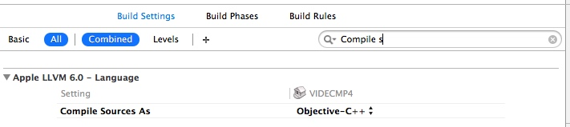
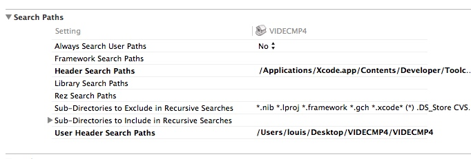

# 字符串的拼接的小demo

#include <stdio.h>
#include <stdlib.h>

void  getDeviceInfo(char *javaScriptStr)
{
    char *mac = "11111";
    char *ip = "22222";
    char *cpuInfo = "33333";

    sprintf(javaScriptStr,"javascript:alert('%s','%s','%s');", mac, ip, cpuInfo);
}

char * getDeviceInfoExt()
{
    char *javaScriptStr = malloc(200);
    char *mac = "11111";
    char *ip = "22222";
    char *cpuInfo = "33333";

    sprintf(javaScriptStr,"javascript:alert('%s','%s','%s');", mac, ip, cpuInfo);
    return javaScriptStr;
}

int main()
{
    char javaScriptStr[200];
    getDeviceInfo(javaScriptStr);
    printf("%s\n", javaScriptStr);

    char *subStr = getDeviceInfoExt();
    printf("%s\n", subStr);
    free(subStr);

    return 0;
}

0c 和c++ 混编
注意   设置head路径的宏：$(PROJECT_DIR)/ffmpeg/lib

1.OC和c++混编用到的编译器是Objective-C++
     所以，第一步将conpile source修改成object-c++

2.c++中如何调用OC

     简单点说就是在oc中写一个弱类型，说白了就是在oc里写几个方法，这些方法是c类型的，比如 -（BOOL）SetSomthing，就写成
BOOL SetSomething();

c++ 中调用self

3.在oc中调用c++
     这个个人总结，其实跟c++调用oc一样，只不过把c++对象当作成员变量来使用而已，没有什么区别

参考：http://www.cnblogs.com/linyawen/archive/2012/05/02/2479215.html

c语言里结构体里冒号是什么作用？

参考：http://blog.csdn.net/cyhleo/article/details/6845462

#include <stdio.h>

/***********************************************************************************************
 *华平16位（2字节）关键帧格式
 *语法解析：unsigned short ver:2;
 *类型说明符位域名：位域长度
 ***********************************************************************************************/
typedefstructtagVIDEC_HEADER_EXT
{
   unsignedint  ts;
   
unsignedshortactual_width;
unsignedshortactual_height;
unsignedshortvirtual_width;
unsignedshortvirtual_height;

}VIDEC_HEADER_EXT,*PVIDEC_HEADER_EXT;

typedefstructabc
{
   inta:1;
   intb:1;
   intc:1;
   intd:1;
}ddddd;

typedefstructddddeee
{
   inta;
   intb;
   intc;
   intd;
}fffffff;

intmain()
{
    printf ("size:%lu\r\n",sizeof(VIDEC_HEADER_EXT));
       printf ("size:%lu\r\n",sizeof(ddddd));
      printf ("size:%lu\r\n",sizeof(fffffff));
return0;
}

输出：16 （这里算应该是15，但字节对齐是16），4，16 

如何在oc中设置回调函数？
if (!PlayM4_SetDecCallBack(_hDecode, HikDecCallback))
    {
        NSLog(@"====PlayM4_SetDecCallBack:%d", _hDecode);
         return -1;
    }

void CALLBACK HikDecCallback(int nPort,char * pBuf,int nSize,FRAME_INFO * pFrameInfo, int nUser,int nReserved2)
{
    NSLog(@"callback data :%d", nSize);
}

