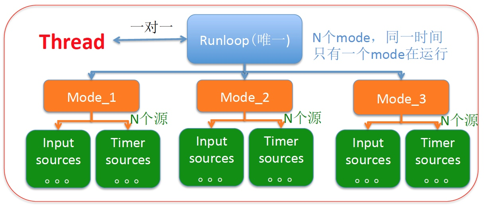

# runloop 有几种模式？
模式包括：

default模式：几乎包括所有输入源(除NSConnection) NSDefaultRunLoopMode模式

mode模式：处理modal panels

connection模式：处理NSConnection事件，属于系统内部，用户基本不用

event tracking模式：如组件拖动输入源 UITrackingRunLoopModes 不处理定时事件

common modes模式：NSRunLoopCommonModes 这是一组可配置的通用模式。将input sources与该模式关联则同时也将input sources与该组中的其它模式进行了关联。

对于selector：

1.这些方法是添加到runloop的，所以如果没有开启runloop的话，不会运行（也就是不会被调用，如timer事件）
2.一般情况下aSelector会添加到指定线程的runloop。但，如果调用线程和指定线程为同一线程，且wait参数设为YES，那么aSelector会直接在指定线程运行，不再添加到runloop。
1. runloop与线程是一一对应的，一个runloop对应一个核心的线程，为什么说是核心的，是因为runloop是可以嵌套的，但是核心的只能有一个，他们的关系保存在一个全局的字典里。
2. runloop是来管理线程的，当线程的runloop被开启后，线程会在执行完任务后进入休眠状态，有了任务就会被唤醒去执行任务。
3. runloop在第一次获取时被创建，在线程结束时被销毁。
4. 对于主线程来说，runloop在程序一启动就默认创建好了。
5. 对于子线程来说，runloop是懒加载的，只有当我们使用的时候才会创建，所以在子线程用定时器要注意：确保子线程的runloop被创建，不然定时器不会回调。

参考：http://www.cnblogs.com/mddblog/p/6435510.html

