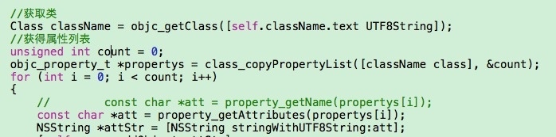

# 交换方法

通过从写它的systemFontOfSize 方法，进行方法替换，把size改小做适配，这个不能修改xib中的字体，只有用了systemFontOfSize方法的才会生效

头文件

```
//
//  UIFont+adapt.h
//  TKApp
//
//  Created by 叶璐 on 18/2/17.
//  Copyright © 2017年 liubao. All rights reserved.
//

#import <UIKit/UIKit.h>
#import <objc/runtime.h>

#define IS_IPHONE_6 ([[UIScreen mainScreen] bounds].size.height == 667.0f)
#define IS_IPHONE_6_PLUS ([[UIScreen mainScreen] bounds].size.height == 736.0f)

// 屏幕适配是按照6p来做，所以6的字号减一，如6p是17号字体，6是16号
#define IPHONE6_INCREMENT 1

// 屏幕适配是按照6p来做，所以5S字号要减二，如6p是17号字体，6是15号
#define IPHONE5S_INCREMENT 2

@interface UIFont (adapt)

+(UIFont *)adjustFont:(CGFloat)fontSize;

@end

```

m文件

```

#import "UIFont+adapt.h"

@implementation UIFont (adapt)

+(void)load{
    //获取替换后的类方法
    Method newMethod = class_getClassMethod([self class], @selector(adjustFont:));
    //获取替换前的类方法
    Method method = class_getClassMethod([self class], @selector(systemFontOfSize:));
    //然后交换类方法
    method_exchangeImplementations(newMethod, method);
}

+(UIFont *)adjustFont:(CGFloat)fontSize{
    UIFont *newFont=nil;
    if (IS_IPHONE_6){
        newFont = [UIFont adjustFont:fontSize - IPHONE6_INCREMENT];
    }else if (IS_IPHONE_6_PLUS){
        newFont = [UIFont adjustFont:fontSize];
    }else{
        newFont = [UIFont adjustFont:fontSize - IPHONE5S_INCREMENT];
    }
    return newFont;
}

@end

```


ui类成员属性的方法


#import <objc/runtime.h>

可以参考MJExtention



