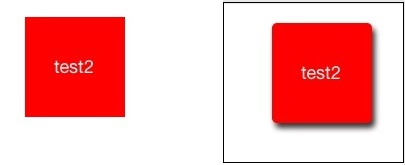

#     btn6.layer.cornerRadius=5;// 设置圆角
    btn6.layer.shadowOffset= CGSizeMake(3,5);// 修改x，y偏移位置
    btn6.layer.shadowOpacity=0.8;// 透明度
    btn6.layer.shadowColor=  [UIColorblackColor].CGColor;// 阴影颜色

