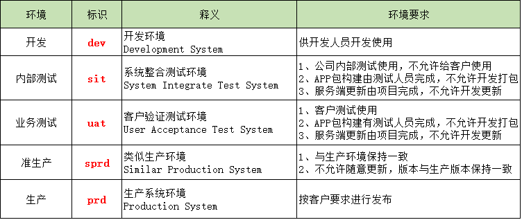

# UILabel

# 1. 计算富文本字体高度

```swift
/**
 *计算富文本字体高度
 *@param lineSpeace 行高
 *@param font       字体
 *@param width      字体所占宽度
 *@return 富文本高度
 */
-(CGFloat)getSpaceLabelHeightwithSpeace:(CGFloat)lineSpeace withFont:(UIFont*)font withWidth:(CGFloat)width text:(NSString *)text{

    
    NSMutableParagraphStyle *paraStyle = [[NSMutableParagraphStyle alloc] init];
    
    /** 行高 */
    paraStyle.lineSpacing= lineSpeace;
    
    // NSKernAttributeName字体间距
    NSDictionary *dic = @{NSFontAttributeName:font, NSParagraphStyleAttributeName:paraStyle, NSKernAttributeName:@1.5f};
    CGSize size = [text boundingRectWithSize:CGSizeMake(width,MAXFLOAT) options:NSStringDrawingUsesLineFragmentOrigin attributes:dic context:nil].size;
    
    return size.height;
}
```

使用方法：

```
CGFloat hight = [self getSpaceLabelHeightwithSpeace:4 withFont:self.messageLabel.font withWidth:kAlertWidth text:message];
```

# 2 计算普通文本高度
 
 
```swift
- (CGSize)stringSizeWithFont:(UIFont *)font str:(NSString *)str preComputeSize:(CGSize)preSize
{
    CGSize stringSize = [str boundingRectWithSize:CGSizeMake(preSize.width, MAXFLOAT) options:NSStringDrawingUsesLineFragmentOrigin attributes:@{NSFontAttributeName: font} context:nil].size;
    
    return stringSize;
}
```

使用方法:

```
CGSize size = [self stringSizeWithFont:self.messageLabel.font str:message preComputeSize:CGSizeMake(kAlertWidth - 20*2*2, CGFLOAT_MAX)];
```

# 3.修改字体颜色

```swift
- (NSMutableAttributedString *)gerAttributedStr:(NSString
 *)str
{
    NSString *newStr = [NSString stringWithFormat:@"#答# %@", str];
    
    NSMutableAttributedString *attributedStr = [[NSMutableAttributedString alloc]initWithString:newStr];
    [attributedStr addAttribute:NSForegroundColorAttributeName                        
value:[TKUIHelper colorWithHexString:@"EB6877"]                  
range:NSMakeRange(0, 3)];
    
    return attributedStr;
}
```

# 4.修改行间距：
设置label的富文本就可以了

```swift
// 调整行间距
NSMutableAttributedString *attributedString = [[NSMutableAttributedString alloc] initWithString:str];
NSMutableParagraphStyle *paragraphStyle = [[NSMutableParagraphStyle alloc] init];
// 设置文字居中
paragraphStyle.alignment = NSTextAlignmentCenter;
[paragraphStyle setLineSpacing:12];
[attributedString addAttribute:NSParagraphStyleAttributeName value:paragraphStyle range:NSMakeRange(0, [str length])];


label.text = attributedString;

```


