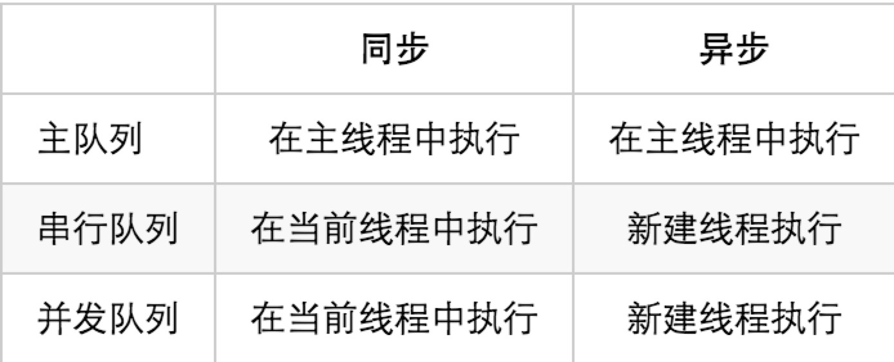

[toc]
# 1.什么是线程？
线程就是程序任务执行（执行流）的最小单位，相当于说开辟一个线程就是给一个人安排了一个任务，任务的内容不固定
# 2.线程什么时候结束？
任务完成后线程回收，也就是这个人就死了。

# 3.线程和队列有什么关系？

# 4.苹果也有Async 为何大家都还是用Robbin的socket库？
https://opensource.apple.com/source/HTTPServer/HTTPServer-11/CocoaHTTPServer/Vendor/CocoaAsyncSocket/

github 上也有
https://github.com/robbiehanson/CocoaAsyncSocket

细心的你会发现，这两个的作者是一个人，代码是一样的，也就是说苹果婊盗用了Robbin大神的作品。（虽然官方也在About.txt中大胆的承认了）

# 5.服务器不需要弄什么就可以直接链接么？
# 6.服务器发直接就可以发送数据了？
# 7.异步socket ，有没有同步的socket？

