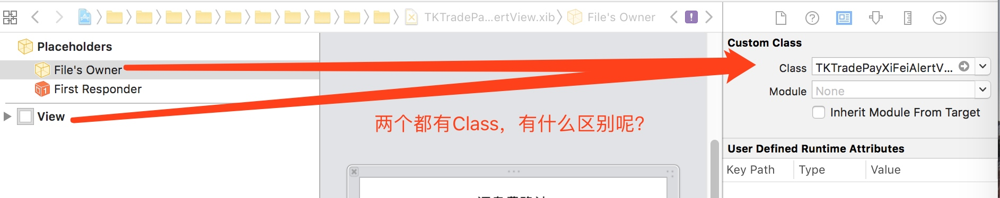

## 1 正确创建XIB + 类的方法，
1.ClassA.h + ClassA.m + ClassA.xib 
2.在ClassA.xib 中的View中指定Custom Class 的Class为ClassA
3.初始化
ClassA *alertView = [[[NSBundle mainBundle] loadNibNamed:@"ClassA" owner:self options:nil] firstObject];

## 1.1 问题
1.为什么不能用Files Owner 的Class，也就是xib 中File's Owner 中的class 和View 中的Class有什么区别？

答：
> 前提：
一个XIB中可以有多个View，每个View都能有自己的Owner，每个View中还能有很多View，其中每个View都可以是自定义View

所以View中的Custom Class 的class就是自定义View的View的类名称，如你自定义的ClassA类

那么owner 是什么作用呢
先看一下我们的代码写View
例子：在ViewA 中调用ViewB的属性和响应其点击事件
1.需要ViewB中的一个属性btn

>那么第一点要在ViewB的头文件中声明一个UIButton *btn，A中使用的时候，以B.btn方式调用。
好，关联到xib，如果你ViewB 是一个XIB的View，这个时候相当于你的VIewB添加了一个IBOutlet。

装逼分析失败：
>但是如果你是把ViewB的Owner的class写成了ViewB，也是能拉IBOut线的，为什么呢，因为这个时候相当于把ViewB的XIB作为ViewB的属性来处理了，理不清，这么用就会崩溃V_V

2.需要View中一个button的点击事件，onBtnClicked
这个时候需要addtargt到ViewA，有个delegate 设置成了ViewA。这个动作就相当于你XIB的ViewB拖了一个IBOutlet的事件到了ViewA上了，这个时候Owner就填写ViewA，相当于这里指定了delegate

区别：** 重点 **
owner 中的class是用来🔝代理响应的对象的
view中的class是用来指定类对象的，也就是你这个view是什么自定义的view

