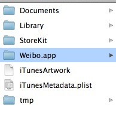

[toc]
# 1.iOS 本地化（持久化）的方法总结
简述：
iOS 本地化分为：NSUserDefault，归档，CoreData，Sqilte四种  

> 出于安全考虑， iOS将每个应用程序限制在属于自己的特定文件内，其他app没有权限访问到此文件夹， 这就是app的沙盒。



>  [iOS的应用程序常用的文件目录](http://www.jianshu.com/p/dd3f120eb249)

* AppName.app   
这是应用程序的程序包目录，包含应用程序的本身。由于应用程序必须经过签名，所以您在运行时不能对这个目录中的内容进行修改，否则可能会使应用程序无法启动。
* Documents      
应用程序的重要数据文件和用户数据文件等都放在这个目录， `iTunes进行备份和恢复时，这个目录会被复制`
* Library   
Preferences 目录：包含应用程序的偏好设置文件。您不应该直接创建偏好设置文件，而是应该使用NSUserDefaults类来取得和设置应用程序的偏好.
Caches 目录：用于存放应用程序专用的支持文件，保存应用程序再次启动过程中需要的信息。
可创建子文件夹。可以用来放置您希望被备份但不希望被用户看到的数据。该路径下的文件夹，除`Caches以外，都会被iTunes备份`。
* tmp/    
这个目录用于存放临时文件，保存应用程序再次启动过程中不需要的信息。该路径下的文件`不会被iTunes备份`。

注意： 一般在Documents目录下存放最重要而且不庞大的文件，否则iTunes备份需要花费较长时间。

> 使用系统api 访问沙盒里面的文件夹的方法：

```
// 获取沙盒主目录路径
NSString *homeDir = NSHomeDirectory();
// 获取Documents目录路径
NSString *docDir = [NSSearchPathForDirectoriesInDomains(NSDocumentDirectory, NSUserDomainMask, YES) firstObject];
// 获取Library的目录路径
NSString *libDir = [NSSearchPathForDirectoriesInDomains(NSLibraryDirectory, NSUserDomainMask, YES) lastObject];
// 获取Caches目录路径
NSString *cachesDir = [NSSearchPathForDirectoriesInDomains(NSCachesDirectory, NSUserDomainMask, YES) firstObject];
// 获取tmp目录路径
NSString *tmpDir =  NSTemporaryDirectory();
``` 

> 获取应用程序程序包中资源文件路径的方法：

```
NSLog(@"%@",[[NSBundle mainBundle] bundlePath]);
NSString *imagePath = [[NSBundle mainBundle] pathForResource:@"apple" ofType:@"png"];
UIImage *appleImage = [[UIImage alloc] initWithContentsOfFile:imagePath];
```

> 常见目录的宏：

```
* NSDocumentDirectory
 <Application_Home>/Documents
* NSCachesDirectory
 <Application_Home>/Library/Caches
* NSApplicationSupportDirectory
 <Application_Home>/Library/ Application Support
``` 

# 2.关于NSUserDefaults保存不了数据的问题

```swift
If you terminate your app by pressing the home button (in the Simulator or on the device), your User Defaults will get saved.
```
如果你按HOME键终止你的应用（真机或者模拟器上），你的值是会被保存的。

```swift
If you terminate your app by pressing "Stop" in Xcode (in the Simulator or on the device), your User Defaults might get saved, but there's a good chance they won't. NSUserDefaults persists any changes periodically, and if you terminate the process before they've been persisted, they'll be gone. You can force the save by calling:

[[NSUserDefaults standardUserDefaults] synchronize];
```
如果你在XCODE中，终止你的应用（在模拟器或者真机上），你的值或许不会被保存。原因在于
你可以使用以下代码强制保存

```swift
[[NSUserDefaults standardUserDefaults] synchronize];
```

# 3. 获取真机沙盒数据
## 3.1 选择Device

## 3.2 Download Container

## 3.3 显示包内容


