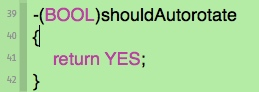

# 1.iOS10  获取网络权限，判断被系统错误关闭的情况

```swift
- (void)checkCellularDataRestrictedState
{
    if ([[[UIDevice currentDevice] systemVersion] floatValue] >= 9.0) {
        CTCellularData *cellularData = [[CTCellularData alloc]init];
        cellularData.cellularDataRestrictionDidUpdateNotifier =^(CTCellularDataRestrictedStatestate)
        {
            //获取联网状态
            switch(state) {
                case kCTCellularDataRestricted :
                {
                    dispatch_async(dispatch_get_main_queue(), ^{
                       TKLayerView *alert = [[TKLayerView alloc]initContentView:self.window withBtnTextColor:@"#000000"];
                       [alert showConfirm:@"是否打开设置？" title:@"您当前网络访问权限已被限制" confirmAction:^{
                            NSURL *appSettings = [NSURL URLWithString:UIApplicationOpenSettingsURLString];
                            [[UIApplication sharedApplication] openURL:appSettings];
                        }
                        cancelAction:^{}];
                   });
                
                    break;
                }
                case kCTCellularDataNotRestricted:
                    break;
                case kCTCellularDataRestrictedStateUnknown:
                    break;
                default:
                    break;
            };
        };
    }
}
```

# 2.获取当前摄像头方向
在开启屏幕旋转的情况下：
https://my.oschina.net/wolx/blog/387315

在没有开启的情况下，就得用重力加速度来做了。
参考：http://www.jianshu.com/p/72d6c63006b3

#3.iOS中旋转屏幕的几种方法
如何在关闭旋转的时候获取屏幕当前的方向？

- (BOOL)shouldAutorotate
方法名称：shouldAutorotate
作用：决定系统是否支持自动翻转屏幕
使用方法：

- (NSUInteger)supportedInterfaceOrientations
方法名称：supportedInterfaceOrientations
作用：返回一个ViewController支持的方向，也就是说你返回这个方向是你屏幕启动后就保持的方向，如让他默认横屏或者竖屏
注意事项： 
          1.仅在IOS6 以后才能用
          2.用户在每次改变屏幕转动方向的时候，会先调用shouldAutorotate，再调用它，这就说明，仅在shouldAutorotate方法返回值是YES的时候这个方法才会起作用！
       3.如果没有重写这个方法，ipad默认返回的值是UIInterfaceOrientationMaskAll ，iphone默认返回的值是UIInterfaceOrientationMaskAllButUpsideDown，也就是说默认情况下iOS是支持翻转屏幕的
使用方法：

http://blog.csdn.net/volcan1987/article/details/11563741

强制旋转屏幕
if ([[UIDevice currentDevice] respondsToSelector:@selector(setOrientation:)]) {  
            SEL selector = NSSelectorFromString(@"setOrientation:");  
            NSInvocation *invocation = [NSInvocation invocationWithMethodSignature:[UIDevice instanceMethodSignatureForSelector:selector]];  
            [invocation setSelector:selector];  
            [invocation setTarget:[UIDevice currentDevice]];  
            int val = UIInterfaceOrientationLandscapeRight;  
            [invocation setArgument:&val atIndex:2];  
            [invocation invoke];  
  }


在横竖屏状态下如何修改view的frame合适？

答：把上面的程序稍微修改一下，来看一组值得研究一下的结果（此viewController由带导航条的navigationController推送），实际上不用navigationController而直接加载这个vc，结果又不一样，viewDidAppear会在最后viewDidLayoutSubviews之后才调用，其他顺序不变，乱吧……
didLoadFrame :(0.000000, 20.000000, 768.000000, 1004.000000) direction:(1, 1)
didLoadBounds :(0.000000, 0.000000, 768.000000, 1004.000000) direction:(1, 1)
initFrame :(0.000000, 20.000000, 768.000000, 1004.000000) direction:(1, 1)
initBounds :(0.000000, 0.000000, 768.000000, 1004.000000) direction:(1, 1)
willAppearFrame :(0.000000, 0.000000, 768.000000, 960.000000) direction:(1, 1)
willAppearBounds :(0.000000, 0.000000, 768.000000, 960.000000) direction:(1, 1)
didAppearFrame :(0.000000, 0.000000, 768.000000, 960.000000) direction:(1, 1)
didAppearBounds :(0.000000, 0.000000, 768.000000, 960.000000) direction:(1, 1)
willLayoutFrame :(0.000000, 0.000000, 768.000000, 960.000000) direction:(1, 1)
willLayoutBounds :(0.000000, 0.000000, 768.000000, 960.000000) direction:(1, 1)
didLayoutFrame :(0.000000, 0.000000, 768.000000, 960.000000) direction:(1, 1)
didLayoutBounds :(0.000000, 0.000000, 768.000000, 960.000000) direction:(1, 1)
刚才这个是竖屏的，再来个横屏的：

didLoadFrame :(0.000000, 0.000000, 748.000000, 1024.000000) direction:(3, 3)
didLoadBounds :(0.000000, 0.000000, 748.000000, 1024.000000) direction:(3, 3)
initFrame :(0.000000, 0.000000, 748.000000, 1024.000000) direction:(3, 3)
initBounds :(0.000000, 0.000000, 748.000000, 1024.000000) direction:(3, 3)
willAppearFrame :(0.000000, 0.000000, 1024.000000, 704.000000) direction:(3, 3)
willAppearBounds :(0.000000, 0.000000, 1024.000000, 704.000000) direction:(3, 3)
didAppearFrame :(0.000000, 0.000000, 1024.000000, 704.000000) direction:(3, 3)
didAppearBounds :(0.000000, 0.000000, 1024.000000, 704.000000) direction:(3, 3)
willLayoutFrame :(0.000000, 0.000000, 1024.000000, 704.000000) direction:(3, 3)
willLayoutBounds :(0.000000, 0.000000, 1024.000000, 704.000000) direction:(3, 3)
didLayoutFrame :(0.000000, 0.000000, 1024.000000, 704.000000) direction:(3, 3)
didLayoutBounds :(0.000000, 0.000000, 1024.000000, 704.000000) direction:(3, 3)
总结一下不难发现其特征：1. 在viewWillAppear之前，无论横屏还是竖屏，view的frame和bounds都是按竖屏方式计算的；2. 在viewWillAppear之前，navigationController（而非父view，实际上这个vc的superview是navigationController的view的一个subview）的导航条并没有计算在frame和bounds中，但电池条的宽度是一直计算了的；3. 在转屏时，触发的是viewWillLayoutSubview及viewDidLayoutSubview（data not shown）。

由此结论，我们继续往下想，如果我们要改变self.view的frame值，我们应当在哪个方法中修改呢？很容易想到的是，init和viewDidLoad中是不行的，实践证明，在viewWillAppear中也是不行的，要在viewDidAppear/viewWillLayoutSubviews/viewDidLayoutSubviews方法中修改才能产生效果。


