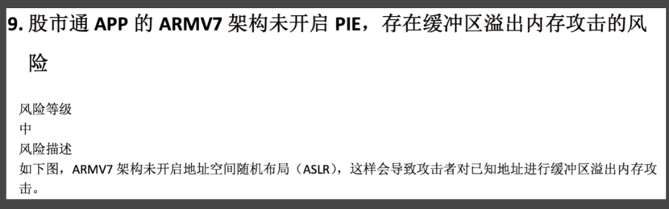
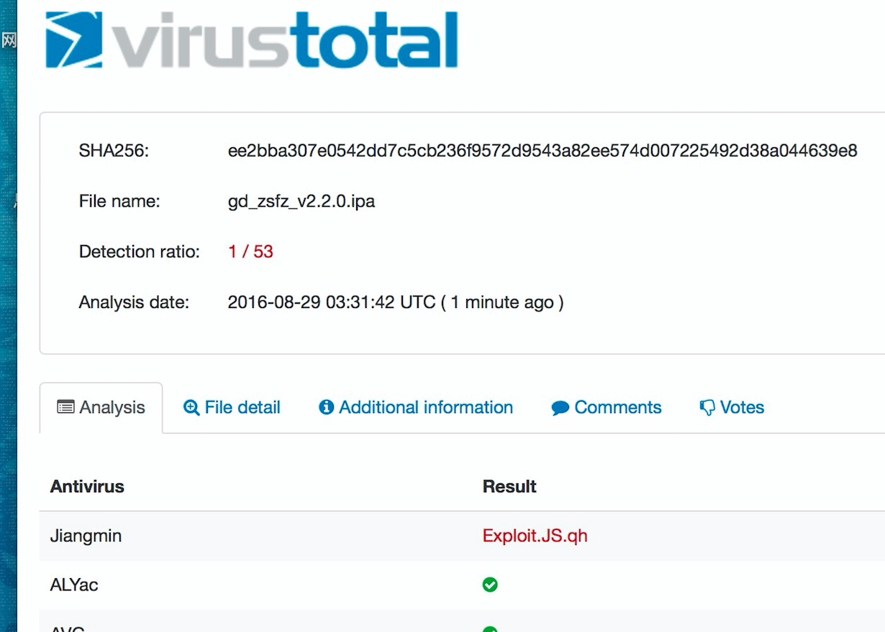
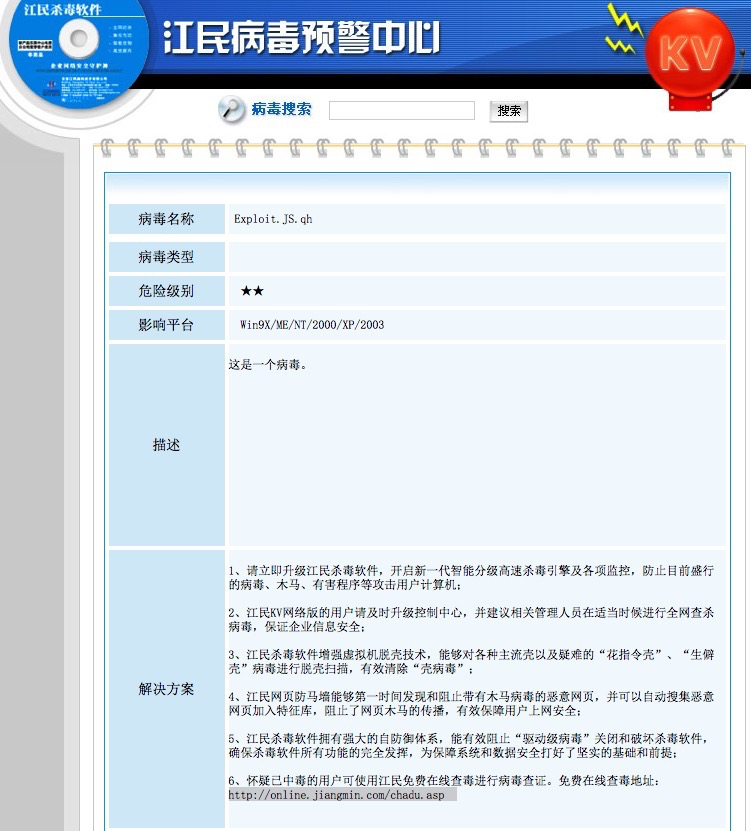
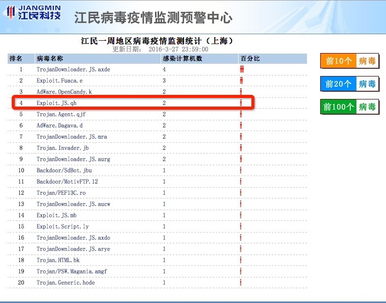
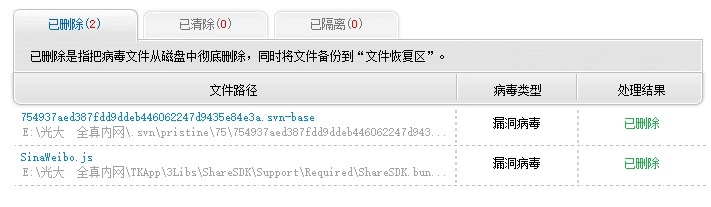
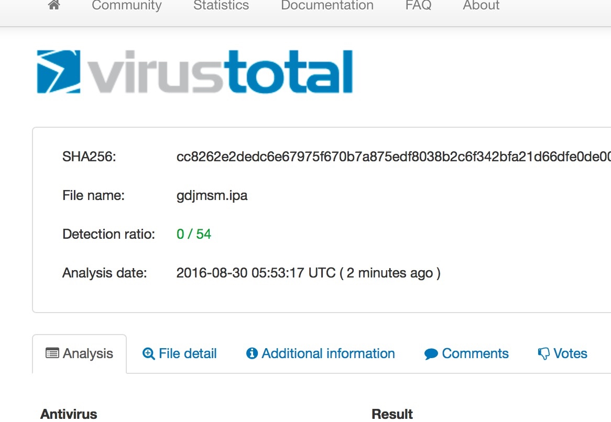

# 1)【iOS】光大证券SDK 不正确的使用了NSURLProtocol，导致整个APP 的UIWebView 加载的HTTPS 连接证书校验出现问题

用https://www.virustotal.com/en 查杀病毒报错的解决办法

1.错误现象

2.错误问题分析
     virustotal是一个开源的病毒查杀引擎，他集成世界上几十家杀毒软件引擎对你上传的东西进行安全扫描。如果有报错就会如图那样显示。其中Antivirus是杀毒引擎厂商，这个发现病毒的厂商是江民（很老的杀毒厂商），根据关键字"Jiangmin Exploit.JS.qh”上谷歌一查，就会发现

很明显这里就是说江民杀毒发现你ipa里有Exploit.JS.qh病毒，很有可能就是你源码里的js文件被感染了，因为c代码经过编译是不可能存在病毒的，这个时候把源码放到windows下用江民杀毒查杀一下，就会发现

然后你根据你的情况，删除这两个文件或者替换这两个文件就可以。看再次打包的效果：

