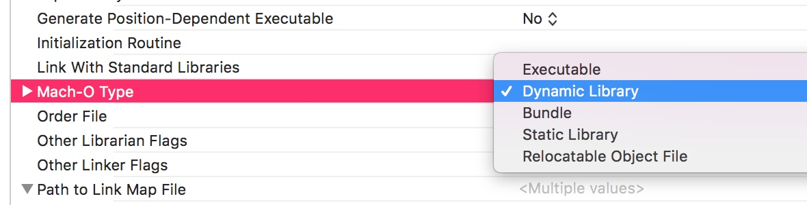

# Framework

1.新建的Framework 假静态库？宝哥工程中的跟系统构建的有什么不同？
直接新建的默认的是Dynamic Library，这个标准的动态库，这种库在引用和使用的时候其实是用不了的，需要修改成static Library

2.Framework是动态库，有什么优势？
默认建立的工程是动态库的，有一个优点就是他还能把
1.资源文件一起打包进framework 
2.共享沙盒的访问权限，但只是APP Extension能够共享，沙盒间还是不能共享的。
3.注意iOS7 是不支持动态库的，所以我们都是用的伪动态库，也就是上面的static Library的形式

我们用的其实是伪静态库（加载了二进制执行文件），真正的动态库是运行时加载的。
这个的好处就是资源封装比较多，版本信息管理、引入管理、头文件暴露管理比静态库方便
http://www.tuicool.com/articles/BVRjQj3

3.Cross platform 的Aggregate 和External Build system 区别
Aggregate 貌似是集合，用作执行某个脚本用的
External  生成的target 会去默认的/user/bin/目录下执行make命令，需要你在里面生成makefile文件，一般makefile文件是用来编译c的，不知道能不能编译oc

