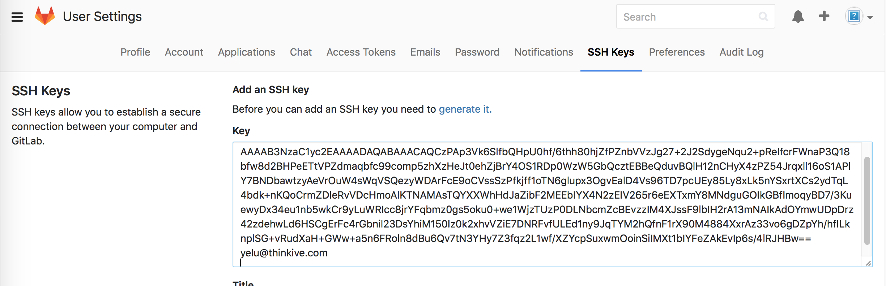

#1. Git 命令
1.1 查看远程仓库地址
git remote -v


1.Git如何和之前的版本做比较？
如我当前版本10，我要和5版本比较，怎么做？


比较当前的文件和那个文件之间的差异

```
git diff 你要比较的版本号 -- 文件名称
git diff c2a2850 -- Git.md
```
比较某某版本跟某某版本区别则再加一个版本号

```
git diff 你要比较的版本号1 你要比较的版本号2 -- 文件名称
git diff 16jdga5 c2a2850 -- Git.md
```

输出,其中加号部分为添加了的内容,但是这个看起来很不舒服，特别是改动很大的情况下，产生的差异特别多，不知道怎么看了。

```log
diff --git "a/\345\267\245\345\205\267\344\275\277\347\224\250/Git.md" "b/\345\267\245\345\205\267\344\275\277\347\224\250/Git.md"
index 718fdab..8db45b1 100644
--- "a/\345\267\245\345\205\267\344\275\277\347\224\250/Git.md"
+++ "b/\345\267\245\345\205\267\344\275\277\347\224\250/Git.md"
@@ -1,3 +1,11 @@
 # 1.Git如何和之前的版本做比较？
 如我当前版本10，我要和5版本比较，怎么做？
 
+
+# 2.
+
+
+# 3.
+
+# 4.
+
```

1.4 拷贝key到gitlab配置栏


1.5 检测key 是否生效
ssh -T git@192.168.1.63
如果生效会提示：
yeludeMacBook-Pro:.ssh yelu$ ssh -T git@192.168.1.63
Enter passphrase for key '/Users/yelu/.ssh/id_rsa': 
Welcome to GitLab, 叶璐!


1.ssh Key干什么用的？为什么要传到gitlab上做配置？配置完了以后是不是所有人都可以clone？配置多份ssh key（多邮箱）会不会有问题？
1.用来做免密码登录的
2.sshkey相当于公钥，用来做rsa加密的
3.不是所有人都可以clone，必须是跟服务器配置了sshkey才可以，换一台电脑需要再生成一个sshkey,tower 就是有问题，不知道为何，sourceTree可以
4.配置多份sshKey没有关系，可以任意配置多个站点的

2.Git Submodules是干嘛用的？我们不需要使用

用来做依赖的版本管理的，跟cocoaPods功能一样，只不过cocoaPods是用于ObJectC的

https://www.git-tower.com/blog/introducing-git-submodules-in-tower/

介绍：
http://www.open-open.com/lib/view/open1396404725356.html

3.为何tower只能添加root账号，不能添加我的子账号Louis？

4.如何让自己代码支持cocoaPod
http://www.cnblogs.com/zhanggui/p/6003481.html
 如何cocoaPod管理三方源码
http://code4app.com/article/cocoapods-install-usage

5.Xcode7自带Git创建的项目"Couldn’t communicate with a helper application."    
在终端命令行输入以下两行指令即可解决：
xcrun git config --global user.email xxxx--->你的git邮箱📬
xcrun git config --global user.name xxxx--->你的git用户名 

没有用git前就一直在听说github，这个到底是什么？初步的了解就是，git类似于服务器，而github类似于客户端，也是用于代码管理的，有些人用Github有些人用svn，貌似这两个的区别就是，Github是可以联网的，上传到他的服务器上面，具体是不是，让我们一起往下看吧－－－－事实证明不是，Git 和svn同是代码管理的服务，而GitHub是远程托管代码的一个网站而已

1.我最开始很想不明白的事情

1.为什么不用svn而用git？－－－－－－看公司喜好吧，个人喜欢而已,svn是集中管理模式，只有服务器上有代码（有待加深理解），
而git是分布式的管理，每个团队成员都有代码库，同时他也有一个中心代码库，

2.为什么有了gitHub，但是教程里教的都是git的命令行？－－－－－－－－这个是因为git是本地代码托管服务器，github是github代码托管网站提供的一个客户端，哪里要存免费的项目，就得开源自己代码，不能建立私有的项目，所以公司一般不会提交到github上。

3.不明白了，git每个人都有自己的代码库，这个svn也可以有啊，哦，是哦，svn只能合并到主干上，不能合并到自己的代码库里面。

4，sshKey有什么作用：这个是为了防止用户太多，导致管理不过来，然后Gitosis通过 公钥来区分访问的用户的身份

5.gitHub上的项目名称不能有中文否则中文会被替换成－－－－－－符号，如：landaship/UITabBarController----


GitHub客户端使用方法
1.添加工程：
     他添加工程的时候有两个方法：
     1).Create New Repository：创建新的代码存储， 这个保存的代码是在服务器上面的，这个代码会在服务器上创建一个Repository（仓库）
     2).Add Local repository：     创建本地的存储，路径是你选择的地方
                    


2.GitHub怎么做到多人协同开发？
3.如何实现：建立组织／互发邮件和通知的功能
4.如何添加别人开源的代码
     首先获取别人发布的GitHub地址，然后在浏览器中输入那个地址，点击Fork就复制到你的空间了


5.如何提交自己的代码到gitHub
     提交时只commit只是提交到本地，必须sync才会同步到GitHub，如果忘了sync，可以选则右上角的按钮


6. 如何下载代码？（假设我的本地代码没有了，要从新下载怎么下？）


7.如何更新服务器代码到本地？


8. 如何分享我的代码？
这里点击view on GitHub 然后你就可以把打开的网页发送给队友就可以了


9.删除github账户的方法：http://www.cnblogs.com/dyllove98/p/3221872.html


# 10. 版本回退
git reflog  // 找到需要回归的版本
git reset --hard Obfafd（回归的版本号）
紧接着强制推送到远程分支：

git push -f（强行回归）

# 11 git 的默认gitignore路径

~/.gitignore

