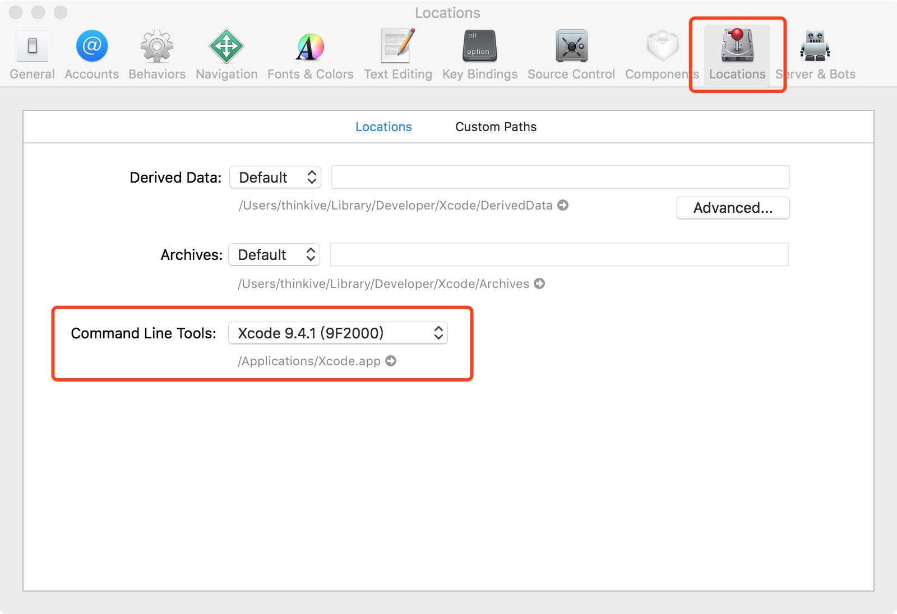

# Clang 看m文件转cpp文件
命令：

```
xcrun -sdk iphonesimulator clang -rewrite-objc 文件名
```

# 1.可能遇到的错误：

```
xcrun -sdk iphonesimulator clang -rewrite-objc AppDelegate.m
xcrun: error: SDK "iphonesimulator" cannot be located
In file included from AppDelegate.m:9:
./AppDelegate.h:9:9: fatal error: 'UIKit/UIKit.h' file not found
#import <UIKit/UIKit.h>
        ^~~~~~~~~~~~~~~
1 error generated.

```
解决办法：https://stackoverflow.com/questions/39564420/i-get-xcrun-error-sdk-iphonesimulator-cannot-be-located-when-running-the-t

1.打开Code
2.打开Preferen
3.打开location
4.command Line Tools：选择当前的xcode编译器版本即可



# 2.不支持__wak

```
/var/folders/ml/r_qwk_s519g9cwbkn4pfvbvr0000gn/T/AppDelegate-207400.mi:54119:20: error: 
      cannot create __weak reference because the current deployment target does
      not support weak references
    __attribute__((objc_ownership(weak))) typeof (_test)BBSelf = _test;
                   ^
1 error generated.
```

解决办法,虽然不知道为何

```
__weak typeof (_test)BBSelf = _test;
改成
__unsafe_unretained typeof (_test)BBSelf = _test;
```


