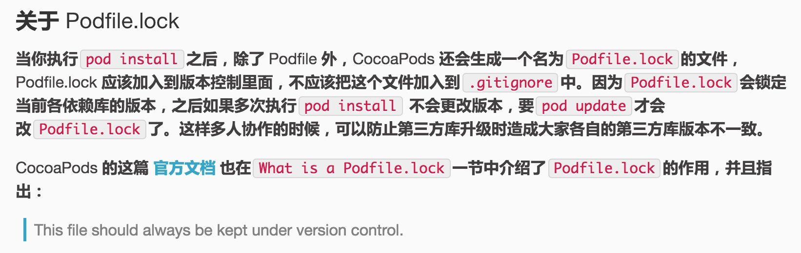

# cocoapod 使用
## 1.新建Podfile

在***.xcodeproj 同级目录下执行命令

```
pod init 即可
```
## 2.编写Podfile,[参数解析](./cocoaPods脚本解析.md)
```
platform :ios, '6.0'
use_frameworks!
target 'TKTrade' do 
pod 'Masonry'
end
```

## 4.导入三方库
如果不是第一次，则 （不更新索引，这样会快一些）
```
pod install --no-repo-update  
```
如果是第一次，则
```
pod install
```

> pod install 和pod update 区别？

```
pod install 只会添加或者删除新添加的pod库文件，不会更新其他已经存在的
pod upate 会更新所有的，所以一般pod update 后面需要加上其他的需要更新的版本号

这个主要体现对Podfile.lock 文件的管理上，多人合作的时候大家都用pod install，这个只会更新lock文件中指定的版本，用此可以保证所有人用的版本是一样的，当需要更新版本时才用pod update，这样lock文件锁定的版本才会更新
```
看唐大大的说法



FAQ 
## 1.cocoaPod 很慢的问题

因为镜像是在github国外网站，然后他每次都要更新cocoapod的源，更新到本地的~/.cocoapods 目录，国外访问慢，所以修改他的源成国内的地址就可以

```
pod repo remove master
pod repo add master https://gitclub.cn/CocoaPods/Specs.git
pod repo update
```
http://blog.csdn.net/nn955/article/details/53043482


忽然发现自己怎么写都没有唐巧大大写的专业，惭愧，一知半解就感写博客了
http://blog.devtang.com/2014/05/25/use-cocoapod-to-manage-ios-lib-dependency/

## 2.KiB/s是什么单位
KB/s 是指1000B/s，KiB/s 是指1024B/s


