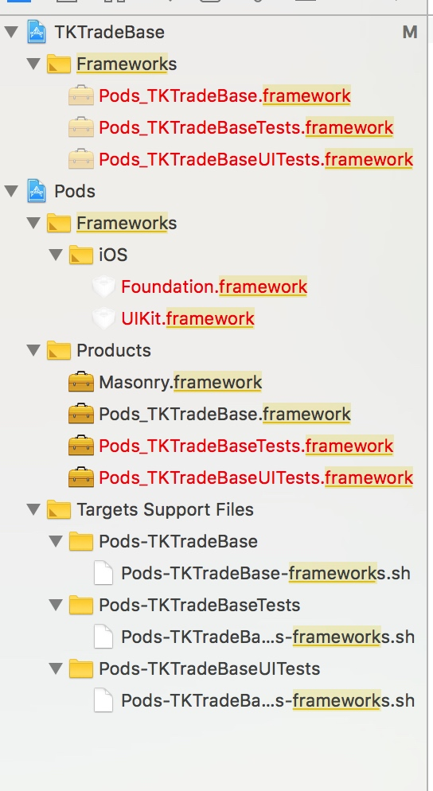
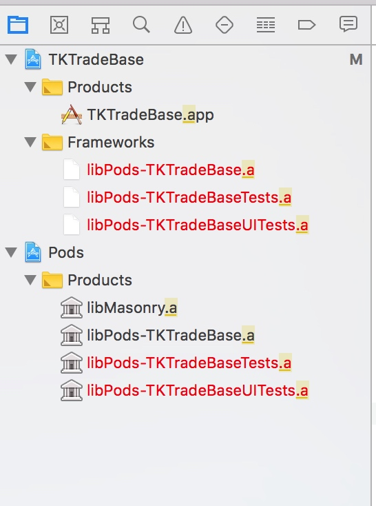

参考：https://www.jianshu.com/p/8af475c4f717

```shell
# 指定从那个源去查找Specs
source 'https://gitclub.cn/CocoaPods/Specs.git'
# 指定的最低兼容的平台
# platform :ios, '6.0'

# 这里可以指定多个target，不同的target可以指定不同的配置，所以默认都需要配置一个target名字
target 'TKTradeBase' do
  # Uncomment the next line if you're using Swift or would like to use dynamic frameworks,这个是指定三方库是用.a 的形式还是用framework的形式添加到项目中的，如果是swift则必须用framework形式,打开注释后需要再pod install一下
  # use_frameworks!

  # Pods for TKTradeBase
  pod 'Masonry'
  
  # 这个是说更新AFNetworking 1.0 到2.0之间到版本，不会大于等于2.0
  pod 'AFNetworking', '~> 1.0'
  
  # 指定只下载0.9 版本的AFNetworking
  pod 'AFNetworking', '0.9'
  
  # >0.1 高于0.1的任何版本
  # >=0.1 版本0.1和任何更高版本
  # <0.1 低于0.1的任何版本
  # <=0.1 版本0.1和任何较低的版本
  # 〜>0.1.2 版本 0.1.2的版本到0.2 ，不包括0.2。这个基于你指定的版本号的最后一个部分。这个例子等效于>= 0.1.2并且 <0.2.0，并且始终是你指定范围内的最新版本
  
  # 指定使用本地的文件
  pod 'AFNetworking', :path => '~/Documents/AFNetworking'
  
  # 指定mster 远程代码
  pod 'AFNetworking', :git => 'https://github.com/gowalla/AFNetworking.git'
  
  # 指定远程分支代码
  pod 'AFNetworking', :git => 'https://github.com/gowalla/AFNetworking.git', :branch => 'dev
  
  # 指定远程某个tag代码
  pod 'AFNetworking', :git => 'https://github.com/gowalla/AFNetworking.git', :tag => '0.7.0'
  
  # 指定远程的某个提交
  pod 'AFNetworking', :git => 'https://github.com/gowalla/AFNetworking.git', :commit => '082f8319af'
 


  target 'TKTradeBaseTests' do
    inherit! :search_paths
    # Pods for testing
  end

  target 'TKTradeBaseUITests' do
    inherit! :search_paths
    # Pods for testing
  end

end
```

开启use_frameworks 之后




