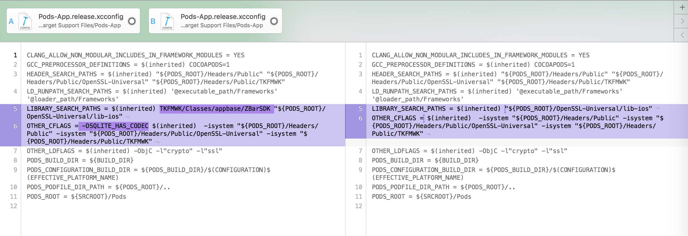

# 1.podspec是什么？
就是项目需要别人下载的代码的配置，工程的配置等信息

# 2.如何生成podspec？
pod spec create TKTradeBase

之后会生成TKFMWK.podspec文件

```
Usage:

    $ pod spec create [NAME(库的名称)|https://github.com/USER/REPO]

      Creates a PodSpec, in the current working dir, called `NAME.podspec'. If a
      GitHub url is passed the spec is prepopulated.

Options:

    --silent    Show nothing
    --verbose   Show more debugging information
    --no-ansi   Show output without ANSI codes
    --help      Show help banner of specified command
```


# TKFMWK.podspec 解析
## 1. 首先修改的时候要把所有的# 的注释删除掉，官方这么说的

```ruby
Pod::Spec.new do |s|
  s.name         = "TKTradeBase"
  # 版本号，版本号必须与私有库的tag一致，因为cocoapods会根据说明书里面的版本号去私有库的remote端拉取同样名称的tag的代码
  s.version      = "0.0.1"
  # 概述
  s.summary      = "A short description of TKTradeBase."

  # 详细描述
  s.description  = <<-DESC
                   DESC
  s.homepage     = "http://EXAMPLE/TKTradeBase"
  s.license      = "MIT"
  s.author             = { "叶璐" => "yelu@thinkive.com" }

  # 最低支持的iOS版本号
  s.platform     = :ios
  # s.platform     = :ios, "5.0"

  #  When using multiple platforms
  # s.ios.deployment_target = "5.0"
  # s.osx.deployment_target = "10.7"
  # s.watchos.deployment_target = "2.0"
  # s.tvos.deployment_target = "9.0"


# 代码地址
  s.source       = { :git => "http://EXAMPLE/TKTradeBase.git", :tag => "#{s.version}" }


  # ――― Source Code ―――――――――――――――――――――――――――――――――――――――――――――――――――――――――――――― #
  #
  #  CocoaPods is smart about how it includes source code. For source files
  #  giving a folder will include any swift, h, m, mm, c & cpp files.
  #  For header files it will include any header in the folder.
  #  Not including the public_header_files will make all headers public.
  #
  # 私有库代码在哪里，此处根据自己的喜好配置
  s.source_files  = "Classes", "Classes/**/*.{h,m}"
  # 不包含什么文件，也就是忽略什么文件
  s.exclude_files = "Classes/Exclude"
  # 公开头文件，这个文件会放在什么地方？
  # s.public_header_files = "Classes/**/*.h"


  # ――― Resources ―――――――――――――――――――――――――――――――――――――――――――――――――――――――――――――――― #
  #
  #  A list of resources included with the Pod. These are copied into the
  #  target bundle with a build phase script. Anything else will be cleaned.
  #  You can preserve files from being cleaned, please don't preserve
  #  non-essential files like tests, examples and documentation.
  #
  # 私有库非代码的资源在哪里
  # s.resource  = "icon.png"
  
  # 感觉这个是用来指定bundle的
  # s.resources = "Resources/*.png"

  # s.preserve_paths = "FilesToSave", "MoreFilesToSave"


  # ――― Project Linking ―――――――――――――――――――――――――――――――――――――――――――――――――――――――――― #
  #
  #  Link your library with frameworks, or libraries. Libraries do not include
  #  the lib prefix of their name.
  #

  # s.framework  = "SomeFramework"
  # s.frameworks = "SomeFramework", "AnotherFramework"

  # s.library   = "iconv"
  # s.libraries = "iconv", "xml2"


  # ――― Project Settings ――――――――――――――――――――――――――――――――――――――――――――――――――――――――― #
  #
  #  If your library depends on compiler flags you can set them in the xcconfig hash
  #  where they will only apply to your library. If you depend on other Podspecs
  #  you can include multiple dependencies to ensure it works.

  # s.requires_arc = true

// 以下是这个私有库本身依赖的三方库 这个不能放在Podfile中 Podfile是指项目的依赖 而此处是私有库的依赖 如果放在Podfile中会无法引用到
  # s.xcconfig = { "HEADER_SEARCH_PATHS" => "$(SDKROOT)/usr/include/libxml2" }
  # s.dependency "JSONKit", "~> 1.4"
 s.dependency 'AFNetworking', '~> 2.5.4'
 
 # 指定自己或者三方的框架包
 s.vendored_framework = 'TKFMWK/TKAppBase_V2.framework'
 
 # 指定pch文件
  s.prefix_header_file = 'PrefixHeader.pch'
  s.prefix_header_contents = <<-EOS
  #ifdef __OBJC__
  #import <UIKit/UIKit.h>
  #import <Foundation/Foundation.h>
  #import <TKAppBase_V2/TKAppBase.h>
  #endif /* __OBJC__*/
  EOS
end
```


(1)--verbose:表示显示全部的日志信息，建议加上这个，方便判断错误信息。

(2)--sources:如果我们在podspec里面依赖到一些私有的库之后，直接进行校验是会报错的提示找不到，这里加上我们的Spec仓库的地址告诉CocoaPods找不到的时候去哪里找。

(3)--allow-warnings:表示允许警告.

(4)--use-libraries:表示使用静态库或者是framework，这里主要是解决当我们依赖一些framework库后校验提示找不到库的时候用到。

(5)在Podfile的文件开头加上Spec的地址，然后就可以向以前一样使用了

# 参考
http://blog.devzeng.com/blog/ios-cocoapods-private-repo.html
https://www.jianshu.com/p/f841e248bc4f

# 3.如何添加私有库

```
pod repo push ThinkiveSpecs Masonry.podspec --allow-warnings
```
>Usage:

    $ pod repo push REPO [NAME.podspec]

      Validates `NAME.podspec` or `*.podspec` in the current working dir,
      creates a directory and version folder for the pod in the local copy of
      `REPO` (~/.cocoapods/repos/[REPO]), copies the podspec file into the
      version directory, and finally it pushes `REPO` to its remote.

（主要是路径问题，导入第三方的framework 用 s.vendored_frameworks 并且不能省略 .framework后缀）
（ 系统的lib开头的，省略前面的lib，用：s.libraries = 'c++.1','z'）

我又用-verbose去看，结果还是没什么详细信息，明明都build成功了，但是linker command failed，于是又去爬文，在pod lint libVideo.podspec后面还要加上 --use-libraries才通过lint


官方使用文档：
https://guides.cocoapods.org/syntax/podspec.html#header_dir


pod lib lint 主要是先把你的文件都下载到目标文件，然后新建一个pod.xcproject工程，按照你的posSpec的配置执行一下xcodeBuild，所以，你工程需要配置什么，都需要在podSpec中配置完

pod lib create 命令解析
https://www.jianshu.com/p/4685af9dd219


搜索不到私有库？
需要重建索引文件：search_index.json
路径：~/Library/Caches/CocoaPods
办法：删除该文件，重新执行search 命令即可，
```
pod search TKFMWK
```


// 感觉没什么作用，就是最后错误的提示不是高亮了
 --no-ansi   Show output without ANSI codes
 
 感觉也没有多快
 --fail-fast   failing platform or subspec
 
 --silent
 不提示任何信息
 
 
 openSSL  官网
 https://github.com/krzyzanowskim/OpenSSL
 
 突破口：
 https://stackoverflow.com/questions/19481125/add-static-library-to-podspec
 
 错误：
 The 'Pods-App' target has transitive dependencies that include static binaries
 
 参考：
 https://stackoverflow.com/questions/30910852/the-pods-target-has-transitive-dependencies-that-include-static-binaries-whe
 实际解决：
 s.static_framework = true（Indicates, that if use_frameworks! is specified, the pod should include a static library framework.）
## use_frameworks 作用：
A、用cocoapods 导入swift 框架 到 swift项目和OC项目都必须要 use_frameworks!
B、使用 dynamic frameworks，必须要在Podfile文件中添加 use_frameworks!

参考：https://segmentfault.com/a/1190000007076865


# 突破口include of non-modular header inside framework module

http://blog.csdn.net/blog_jihq/article/details/52614156


# 同种配置只能写一次，用逗号分开，逗号间可以用换行分开，可以用缩进 
s.user_target_xcconfig = {'CLANG_ALLOW_NON_MODULAR_INCLUDES_IN_FRAMEWORK_MODULES' => 'YES',"OTHER_CFLAGS"=>"-DSQLITE_HAS_CODEC",'LIBRARY_SEARCH_PATHS'=>'TKFMWK/Classes/appbase/ZBarSDK'}


不能这么写

  s.user_target_xcconfig = {"OTHER_CFLAGS"=>"-DSQLITE_HAS_CODEC",'LIBRARY_SEARCH_PATHS'=>'TKFMWK/Classes/appbase/ZBarSDK'}
s.user_target_xcconfig = {'CLANG_ALLOW_NON_MODULAR_INCLUDES_IN_FRAMEWORK_MODULES' => 'YES'}
  
  否则后者会覆盖前者


