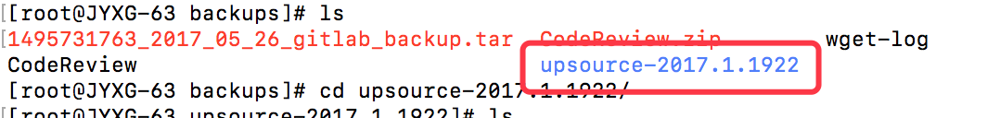
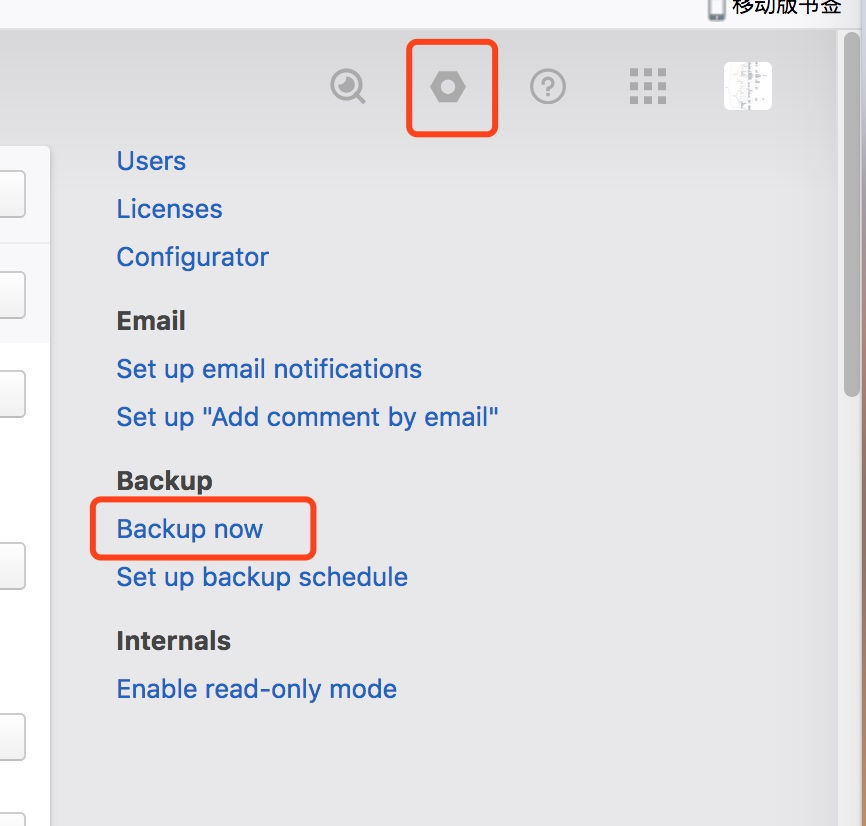

# upsource 
# 1. 安装篇
环境：linux centerOS 6.5

## 1.1.下载zip包（官网下载地址：https://www.jetbrains.com/upsource/download/#section=linux）
wget -O CodeReview.zip https://download.jetbrains.8686c.com/upsource/upsource-2017.1.1922.zip

## 1.2.解压zip
unzip CodeReview.zip

## 1.3.进入解压后的目录

## 1.4.添加一些会引起冲突的linux限制
 vi /etc/security/limits.conf中
添加
* - memlock unlimited
* - nofile 100000
* - nproc 32768
* - as unlimited

## 1.5.启动 (参考：https://www.jetbrains.com/help/upsource/zip-installation.html)
./bin/upsource.sh start

## 1.6.在start 中的日志里会输出你当前访问的url，做个ip替换就可以http://192.168.1.63:8081/welcome

## 1.7.剩下的都按照默认配置来就可以了

## 1.8 备份升级
> 备份是直接用页面上的BackUp按钮即可

> 还原是从BackUp目录中拷贝Conf 和Data文件夹到安装目录覆盖即可，也可以删除了upsrouce的目录，然后重新安装一下，然后就会有一个upgrate的选项，到里面选择到你备份到目录及可以还原了

[官方备份升级文档](https://www.jetbrains.com/help/upsource/backup.html)

