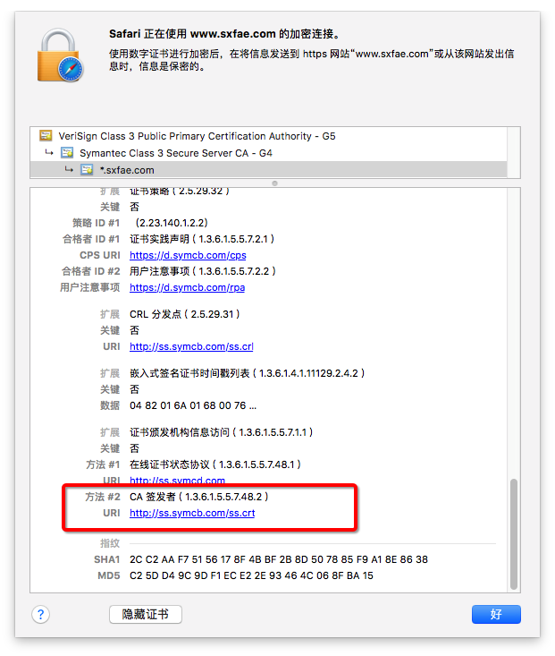
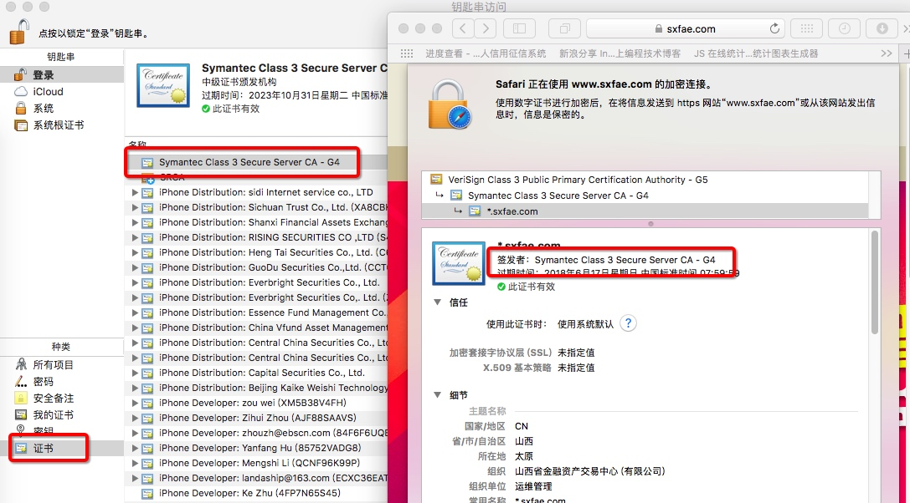
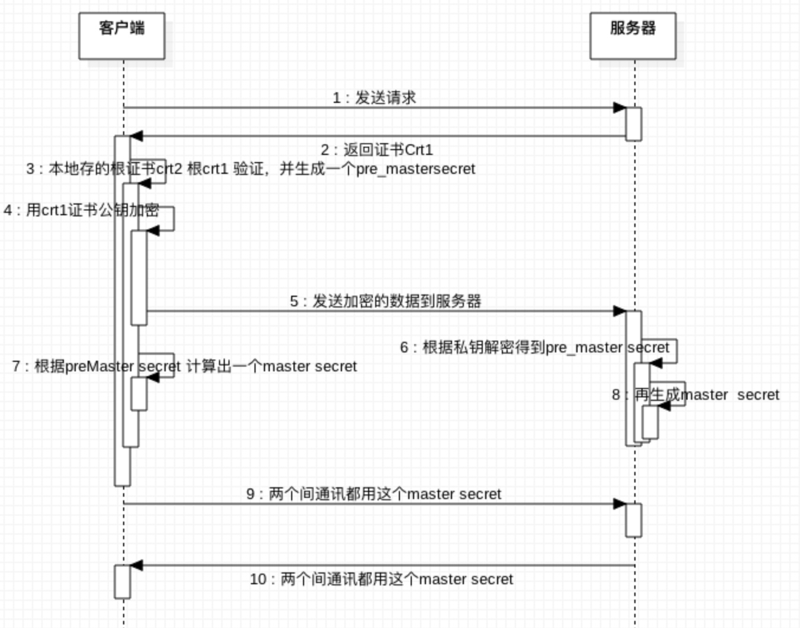

# 1.http 中都有socket？

http 请求中如果有需要用到socket才会有，也就是如果有需要保持长链接才会有socket

# 2. http coockie？

# 3.为何 SDWeb没有cookie？用系统发的请求为何会有cookie？

# 4.get 和post 区别？
# 5.

2.https

1.跨域，什么是跨域（简单理解就是不同站点之间js不能直接调用）
首先什么是跨域，简单地理解就是因为JavaScript同源策略的限制，a.com域名下的js无法操作b.com或是c.a.com域名下的对象。
具体什么样叫跨域，直接看例子更详细的说明：
URL 说明 是否允许通信
http://www.a.com/a.js
http://www.a.com/b.js        同一域名下 允许            
----------------------------------------------------------------------------

http://www.a.com/lab/a.js
http://www.a.com/script/b.js 同一域名下不同文件夹 允许
----------------------------------------------------------------------------
http://www.a.com:8000/a.js
http://www.a.com/b.js 同一域名，不同端口 不允许
----------------------------------------------------------------------------
http://www.a.com/a.js
https://www.a.com/b.js 同一域名，不同协议 不允许
----------------------------------------------------------------------------
http://www.a.com/a.js
http://70.32.92.74/b.js 域名和域名对应ip 不允许
----------------------------------------------------------------------------
http://www.a.com/a.js
http://script.a.com/b.js 主域相同，子域不同 不允许
----------------------------------------------------------------------------
http://www.a.com/a.js
http://a.com/b.js 同一域名，不同二级域名（同上） 不允许（cookie这种情况下也不允许访问）
----------------------------------------------------------------------------
http://www.cnblogs.com/a.js
http://www.a.com/b.js 不同域名 不允许
----------------------------------------------------------------------------
2.session是什么，感觉什么都能存？
     session 是http中的一个会话，存在服务器端，用来记录保持这个会话的。html5 需要用到中支持web storage来管理session ，分sessionStorage和localStorage，他们提供了方法，可以添加删除和修改存到session中的变量，
拓展：        
     session和cookie的区别：他们都是由浏览器（webview）生成的，区别是cookie是存在本地的一个认证标示，session是服务器那边存储的。
     具体区分：http://blog.csdn.net/liguiping2000/article/details/7699231
3.http https
      https ＝ http＋ssl，ssl是一个权威机构颁发的数字证书，大约10刀一年，有了ssl就可以实现加密传输和网站安全认证。
4.我们平时浏览https网站会提示无效证书就是因为这个网站没有有效认证的SSL证书？
   不是，是因为这个网站的SSL证书不被浏览器信任，如12306的证书是自己做的，谷歌浏览器等就不信任他，一直会提示这个是不受信任证书。
     于SSL证书比较特殊，并不是所有CA机构签发的SSL证书都能受浏览器信任，这就是为什么有的网站会出现“该证书不受信任”的浏览器报错。一定要选择全球信任的SSL证书颁发机构，只有通过国际WebTrust认证的CA机构，其根证书预置到微软的操作系统和浏览器中，颁发的SSL证书才能受浏览器信任。
     但WebTrust认证的门槛比较高，中国目前只有三家合法CA通过了WebTrust认证。其中，只有沃通CA颁发的SSL证书，能完美兼容1999年以后的所有浏览器、服务器以及主流移动设备，性能上可完全替代国外SSL证书产品。
5.在我们xcdoe上设置哪些允许ATS是什么鬼？
     App Transport Security(ATS)是Apple为提高系统及应用安全性而在iOS 9和OS X EI Capitan中引入的新特性，这个ATS开启以后默认所有请求是都是https的，xocde7以后新建的项目默认都是开启这个ATS的，所以你要发http请求的时候需要特殊设置ATS。

（NSAllowsArbitraryLoads - 设置true即支持所有HTTP请求）
6.宝哥哪个命令（nscurl --ats-diagnostics --verbose https://www.baidu.com 研究）是干嘛的？AFN 如何和公钥关联的？
宝哥的那个命令是用来检测是否支持ATS协议规定的，在https请求不通的时候可以查询这个，设置白名单等。参考http://www.csdn.net/article/2015-09-11/2825675
7.跟公钥私钥有什么关联？怎么用公钥？
     公钥跟私钥是配对生成的，私钥放在服务器，公钥放在客户端。
     私钥获取方法：
               在申请SSL证书的时候，SSL认证机构给你弄一个key，申请完SSL证书以后它会给你一个私钥一个crt（Retrieve Certificate）文件（domainname.crt文件domainname.key文件），申请的方法：http://jingyan.baidu.com/article/7f41ecec1b722e593d095cee.html，
     公钥生成方法：
               在购买并安装SSL证书之前，你必须在服务器上制作一个CSR文件（该文件中的公钥会用来生成私钥），通过openssl命令直接生成（ http://zh.wikihow.com/安装SSL证书。
  公钥的获取方法：
       你发起一个https会话的时候服务器会返回对应的证书和公钥，AFN会用这个公钥来加密数据，AFN自己内部模块化处理了，有兴趣可以看源码（http://www.cnblogs.com/canghaixiaoyuer/p/4738453.html），
7.AFN设置SSL搞么子？SSL证书可以被伪造，那还怎么搞https？
      因为单方面的服务器认证会出现中间人攻击的问题，也就是别人会对你客户端搞一个SSL伪造，让你访问假的服务器，所以避免中间人攻击，你就必须要客户端也做安全认证，保证访问的是安全ssl证书服务器。具体做法：AFN中加客户端认证：http://www.cnblogs.com/jys509/p/5001566.html
     所以网银这块会搞双向认证（如U顿等）＋防中间人认证（客户端认证服务器返回的证书和本地的CA证书（根证书）是否是一致的）的模式来杜绝SSL证书被伪造的风险
8.openssl是搞么子的？
     openssl 是一个命令，同时跟他同名的是一个是一个强大的安全套接字层密码库，用于加密解密相关的一个很吊的算法库。
9.宝哥的证书认证怎么做了？怎么验证了？
   访问https网站，然后下载其crt证书
   

然后打开钥匙串，导入crt证书，然后再钥匙串的
     要一个cer证书，然后添加宝哥的配置文件，然后如果能够正常访问https网站请求并有返回就是成功的了

10. AFN 如何验证服务器返回的证书和本地的CA证书是否一致？是通过
[mgr setSecurityPolicy:[self customSecurityPolicy]];的方法么？

11.根证书是什么鬼？
简单的理解就是CA证书中心提供的一个证书，就是从浏览器上下载的那个东东crt文件

12:https 是怎么链接的？

为何消息推送的域名地址里不需要配置http

答：http是标示采用的协议
他这里只需要用域名和端口而已

　　格式：
　　http://host[:port][abs_path]
　　其中http表示要通过HTTP协议来定位网络资源。
　　host表示合法的Internet主机域名或IP地址（以点分十进制格式表示）；
　　port用于指定一个端口号，拥有被请求资源的服务器主机监听该端口的TCP连接。
　　如果port是空，则使用缺省的端口80。当服务器的端口不是80的时候，需要显式指定端口号。
　　abs_path指定请求资源的URI(Uniform Resource Identifier，统一资源定位符)，如果URL中没有给出abs_path，那么当它作为请求URI时，必须以“/”的形式给出。通常这个工作浏览器就帮我们完成了。

